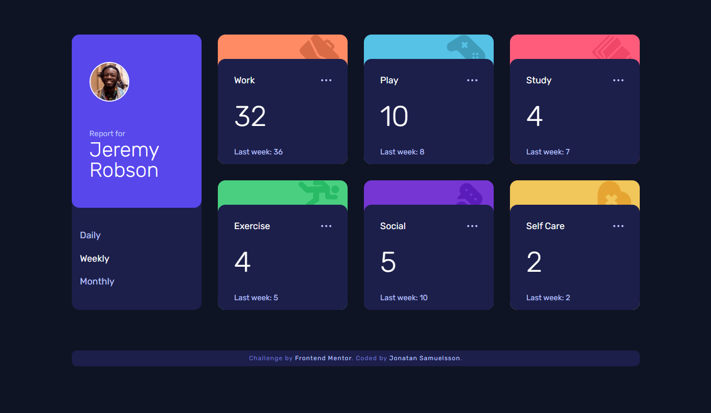
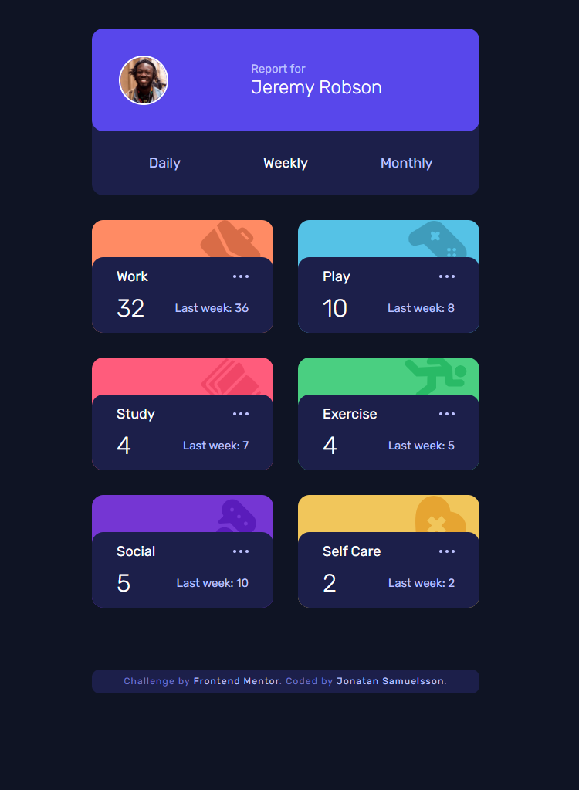
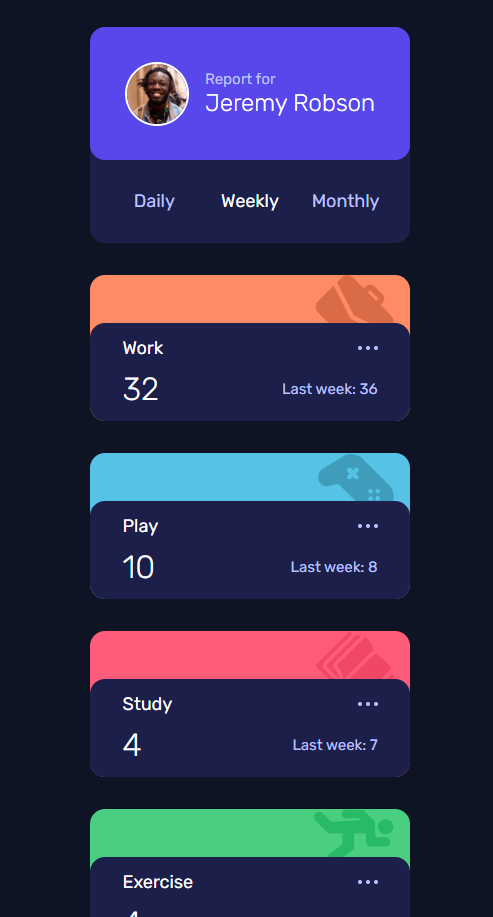

# Frontend Mentor - Time tracking dashboard solution

This is a solution to the [Time tracking dashboard challenge on Frontend Mentor](https://www.frontendmentor.io/challenges/time-tracking-dashboard-UIQ7167Jw). Frontend Mentor challenges help you improve your coding skills by building realistic projects. 

## Table of contents

- [Overview](#overview)
  - [The challenge](#the-challenge)
  - [Screenshot](#screenshot)
  - [Links](#links)
- [My process](#my-process)
  - [Built with](#built-with)
  - [What I learned](#what-i-learned)
  - [Continued development](#continued-development)
  - [Useful resources](#useful-resources)
- [Author](#author)
- [Acknowledgments](#acknowledgments)

**Note: Delete this note and update the table of contents based on what sections you keep.**

## Overview

### The challenge

Users should be able to:

- View the optimal layout for the site depending on their device's screen size
- See hover states for all interactive elements on the page
- Switch between viewing Daily, Weekly, and Monthly stats

### Screenshots

### Links

- [Live Site URL](https://jonatan-samuelsson.github.io/time-tracking-dashboard-main/)

## My process

### Built with

- Semantic HTML5 markup
- CSS custom properties
- Flexbox
- CSS Grid
- Mobile-first workflow
- JavaScript

### What I learned

The frontendmentor article on JS eventhandling was really useful, as I learned to use the `data-`-attribute, which made the code a lot cleaner and more efficient. 

I keep getting better at dealing with elements, HTMLCollections etc in JS, but it's still not entirely clear, so need more practice w/ that.

Also, I felt the site needed a tablet layout as well, so I set up a two column layout as an intermediary between mobile and desktop. 

### Continued development

I need to get more confident handling elements in JS. I keep getting confused with the different types returned by functions like `getElementsByClassName` etc

**Note: Delete this note and the content within this section and replace with your own plans for continued development.**

### Useful resources

- [Kevin Powell's CSS custom properties video](https://www.youtube.com/watch?v=_2LwjfYc1x8) - This really inspired me when styling the different time report cards. It's a super clean and effective way of customizing recurring components without having to use a ton of complex selectors

## Author

- Website - [Add your name here](https://jontesamuelsson.se)
- Frontend Mentor - [@jonatan-samuelsson](https://www.frontendmentor.io/profile/jonatan-samuelsson)

